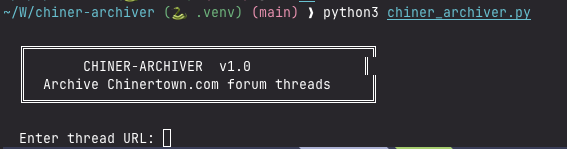

# chiner-archiver

Archive entire threads from [Chinertown.com](https://chinertown.com) (SMF forum). Downloads all post text into a single `.txt` file and saves all images (inline `` tags and forum attachments) into a dedicated folder.



## Features

- SMF forum authentication (login with username/password)
- Full thread pagination — discovers and crawls all pages automatically
- Extracts post text (author, date, body) into a single `.txt` file
- Downloads all user-posted images and attachments
- Outputs everything into a `threads/` directory
- Handles both SEF and query-string SMF URL formats
- Polite crawling with delays between requests

## Setup

Requires [uv](https://docs.astral.sh/uv/) and Python 3.10+.

```sh
# Clone the repo
git clone https://github.com/YOUR_USER/chiner-archiver.git
cd chiner-archiver

# Install dependencies
uv sync
```

## Usage

```sh
# Run with a thread URL
uv run python chiner_archiver.py https://chinertown.com/index.php/topic,5970.0.html

# Or run without arguments to be prompted
uv run python chiner_archiver.py
```

The tool will ask if you need to log in, then archive the full thread:

- **Text** → `threads/<thread-title>.txt`
- **Images** → `threads/<thread-title>_images/`
